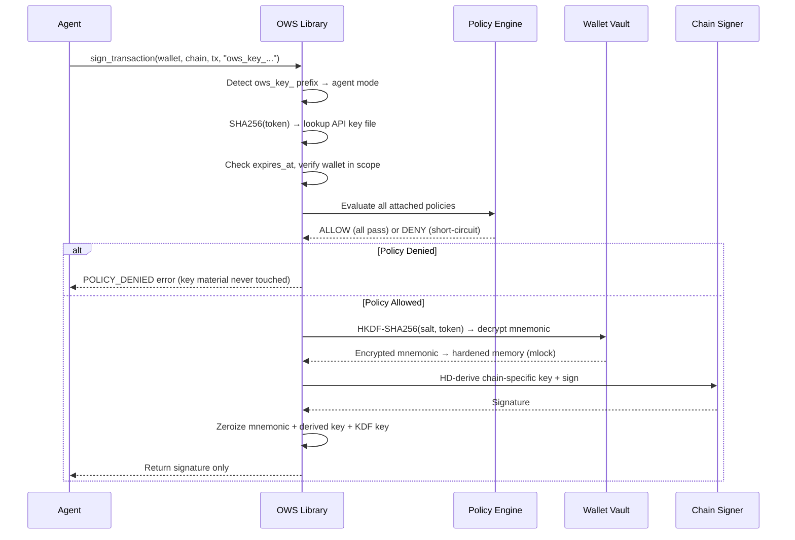
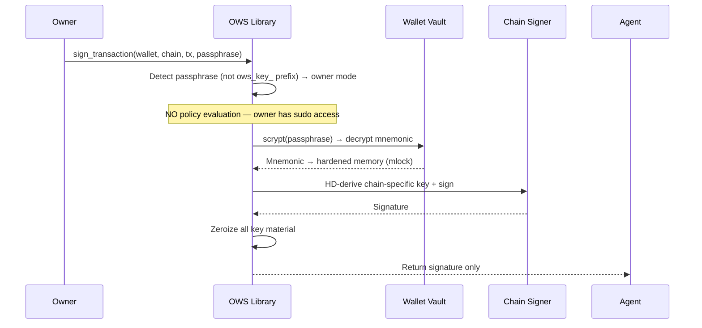

# OWS Architecture

This document is a synthesis of the public OWS architecture story. It combines:

- the homepage architecture framing
- the numbered access-layer, policy, and key-isolation docs
- the public README and SDK docs

When those sources disagree, this document follows the numbered docs for behavioral claims.

## Layered Architecture

```
OWS
├── Access Layer
│   ├── CLI (`ows` command)
│   ├── Node.js SDK (`@open-wallet-standard/core`)
│   ├── Python SDK (`open-wallet-standard`)
│   ├── MCP / REST-style local surfaces (homepage-level examples)
│   └── Other local access profiles defined by `04-agent-access-layer.md`
├── Policy Engine
│   ├── Declarative Rules (allowed_chains, expires_at)
│   ├── Custom Executable Policies (stdin/stdout protocol)
│   └── AND semantics (all policies must pass)
├── Signing Core
│   ├── In-process Rust library
│   ├── Chain-specific signers
│   ├── mlock'd memory + zeroization
│   └── Key caching (short-lived, bounded)
├── Wallet Vault
│   ├── ~/.ows/wallets/ (AES-256-GCM + scrypt encrypted)
│   ├── ~/.ows/keys/ (API key files, HKDF-encrypted)
│   ├── ~/.ows/policies/ (JSON rule definitions)
│   └── ~/.ows/logs/audit.jsonl (append-only)
└── Supported Chains
    ├── EVM (Ethereum, Polygon, Arbitrum, Optimism, Base, BSC, Avalanche)
    ├── Solana
    ├── Bitcoin (BIP-84 native segwit)
    ├── Cosmos
    ├── Tron
    ├── TON
    ├── Sui
    ├── Spark
    └── Filecoin
```

## Public-Source Alignment Notes

Three source-boundary notes matter here:

1. The homepage shows CLI, SDK, MCP, and REST in the interface layer, but `04-agent-access-layer.md` keeps the normative contract abstract and does not require specific package names or transports.
2. The public quickstart shows a `Signing Enclave (isolated proc)` diagram, but `05-key-isolation.md` says the current implementation model is **in-process** and treats the subprocess enclave as a future profile.
3. `07-supported-chains.md` defines **9 chain families** including Spark, while the current CLI / SDK examples for automatically derived accounts show **8** families and do not include Spark in the example output. This file therefore uses the numbered chain doc for the full supported-family set and the SDK docs for current example behavior.

## Architecture Diagram

```
Agent / CLI / App
       │
       │  OWS Interface (SDK / CLI / MCP)
       ▼
┌─────────────────────────┐
│      Access Layer        │     1. Caller invokes sign()
│  ┌───────────────────┐   │     2. Credential detected (passphrase or API token)
│  │   Policy Engine    │   │     3. If API token: policies evaluated BEFORE decryption
│  │  (pre-signing)     │   │     4. Key decrypted in hardened memory (mlock)
│  └────────┬──────────┘   │     5. Chain-specific HD derivation
│  ┌────────▼──────────┐   │     6. Transaction signed
│  │  Signing Core      │   │     7. Key immediately wiped (zeroize)
│  │  (in-process,      │   │     8. Signature returned
│  │   Rust via FFI)    │   │
│  └────────┬──────────┘   │     The OWS API never returns
│  ┌────────▼──────────┐   │     raw private keys.
│  │  Wallet Vault      │   │
│  │  ~/.ows/wallets/   │   │
│  └───────────────────┘   │
└─────────────────────────┘
```

## Signing Flow — Agent Mode



## Signing Flow — Owner Mode



## Access Model

| Tier | Credential | Policy Enforcement |
|------|-----------|-------------------|
| Owner | Wallet passphrase | None. Full access to all wallets. Sudo mode. |
| Agent | `ows_key_...` token | All policies attached to the API key are evaluated. Every policy must allow (AND semantics). |

The credential itself determines the access tier. No bypass flags. No configuration to toggle. The owner uses the passphrase; agents use tokens. Different agents get different tokens with different policies.

If the owner wants policy-constrained access for themselves, they create an API key and use the token instead of the passphrase.

## Access Profiles

The spec defines three conforming access profiles:

### Profile A: In-Process Binding

The caller links directly against the OWS Rust library via FFI (Node.js NAPI, Python PyO3 bindings). Lowest latency, same address space.

### Profile B: Local Subprocess

The caller spawns an OWS child process per operation. Better isolation.

### Profile C: Local Service

A loopback-only daemon or local RPC endpoint. Must bind only to local interfaces.

All profiles MUST preserve the same signing semantics, policy evaluation order, error codes, and audit log behavior.

## Technology Stack

| Layer | Technology |
|-------|-----------|
| Core implementation | Rust |
| Encryption | AES-256-GCM (upgraded from Keystore v3's AES-128-CTR) |
| KDF (wallets) | scrypt (passphrase → encryption key) |
| KDF (API keys) | HKDF-SHA256 (token → encryption key) |
| Memory hardening | mlock, zeroize, anti-ptrace, anti-coredump |
| Chain identifiers | CAIP-2 / CAIP-10 |
| Key derivation | BIP-32 / BIP-39 / BIP-44 |
| Node.js binding | NAPI (native FFI) |
| Python binding | PyO3 (native bindings) |
| License | MIT |

## Primary Sources

- `https://openwallet.sh/`
- `https://github.com/open-wallet-standard/core`
- `https://github.com/open-wallet-standard/core/blob/main/docs/03-policy-engine.md`
- `https://github.com/open-wallet-standard/core/blob/main/docs/04-agent-access-layer.md`
- `https://github.com/open-wallet-standard/core/blob/main/docs/05-key-isolation.md`
- `https://github.com/open-wallet-standard/core/blob/main/docs/07-supported-chains.md`
